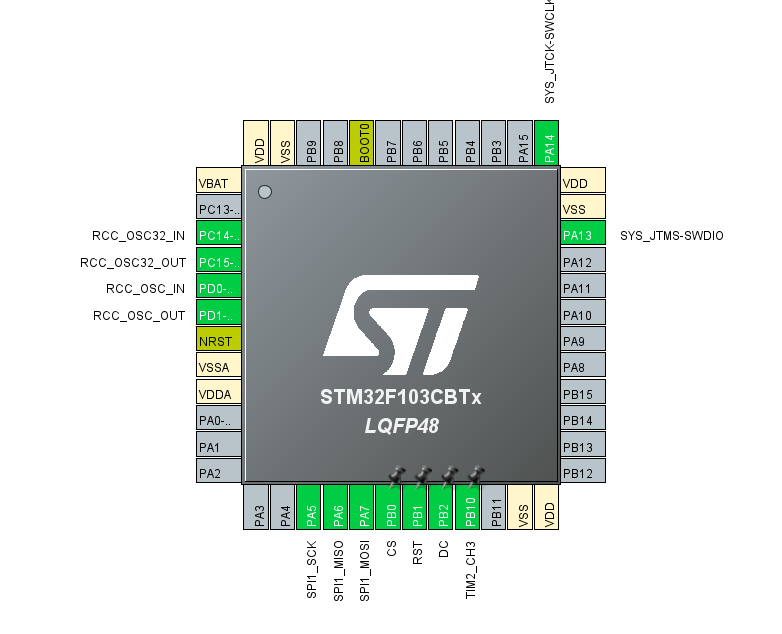

# ST7789 LCD Library
- This library is based on the project by Majid-Derhambakhsh(https://github.com/Majid-Derhambakhsh/ST7789)
- The Russian font support was adapted from GolinskiyKonstantin project (https://github.com/GolinskiyKonstantin/STM32_Lib_TFT_ST7789)
- To enable/apply Russian characters, go to Properties -> C/C++ Build -> Settings -> MCU/MPU GCC Compiler -> Miscellaneous -> Add -> add the following "-fexec-charset=CP1251"

#### The project uses the HAL library and DMA.

# Added features

#### The following functions were optimized:

```c++
void ST7789_FillScreen(ST7789_ColorTypeDef Color);
void ST7789_DrawFilledRectangle(uint16_t XPos, uint16_t YPos, uint16_t Width, uint16_t Height, ST7789_ColorTypeDef Color);
void ST7789_PutString(uint16_t XPos, uint16_t YPos, const char *Str, ST7789_FontTypeDef Font, ST7789_ColorTypeDef Color, ST7789_ColorTypeDef BackgroundColor);
```
"FillScreen" on the STM32f103CBT6 fills the 320x240 display in 80 ms

#### Added functions:

```c++
void ST7789_PutString_Ramk(uint16_t XStart, uint16_t YStart,uint16_t XEnd,uint16_t YEnd, const char *Str, ST7789_FontTypeDef Font, ST7789_ColorTypeDef Color, ST7789_ColorTypeDef BackgroundColor); 
// Writes a string in a given rectangle
void ST7789_EnterSleepMode(void);
void ST7789_SleepModeExit(void);
```

# RAM configuration
#### If you need more RAM you should go to 
Core -> Inc -> st7789_conf.h 
and change ST7789_HOR_LEN but the value must be ST7789_HEIGHT % ST7789_HOR_LEN == 0


# Planned improvements: 
- Add string parsing for correct display output
- Speed ​​up other functions
- Test on other MCUs and in other modes
If anyone wants to do this, please send a pull request.


# Contact
To contact me, use Telegram @Deniska13r


# How to use:
- In CubeMx adding SPI wiht DMA Tx; 
DC, RST, CS GPIO_Output; 
LED GPIO_Output or TIM_PWM (to control brightness)


- Including library to your project
- In cofig file select your SPI Handle; your MCU
- including to main.c 
``` c++
#include "st7789.h"
#include "st7789_font.h" //if you want use ST7789_PutString
```
- Adding to int main()
``` c++
ST7789_Init();
HAL_TIM_PWM_Start(...);
```


